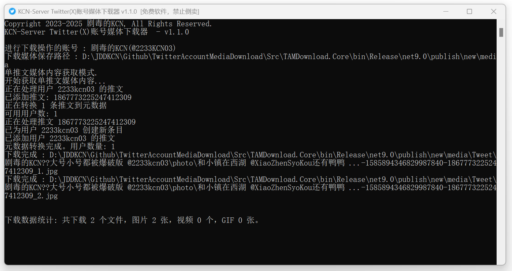
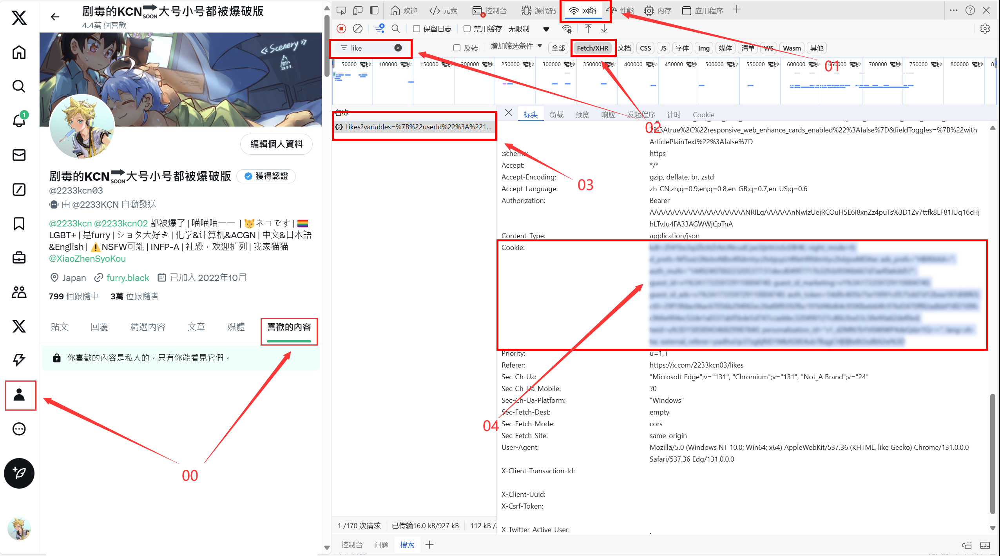

<strong>

# TwitterAccountMediaDownload

</strong>

<strong>

[🇨🇳简体中文](../README.md) | [🇹🇼繁體中文](./README_zh_TW.md) | 🇺🇸English | [🇯🇵日本語](./README_ja_JP.md)

</strong>

## 📘 Project Introduction

This project is a media downloader for Twitter (X) that can fetch liked posts, bookmarks and other media content. Both the core program and GUI are built with `.NET9`. This project is open source under the `A-GPLv3` license.

### ✨ Features
- Customizable media file crawling for likes, bookmarks, or all content.
- Custom crawling for single account or single tweet media files. (New)
- Customizable download types with multi-selection support for images, videos, and GIFs. (New)
- Custom tweet filtering configuration with keyword blocking and time period filtering. (New)
- Custom connection timeout and download retry settings. (New) 
- Automatic download statistics tracking. (New)
- Supports breakpoint resume & incremental updates - continues from last progress on each run.
- Simple proxy configuration options.
- Redesigned user-friendly GUI interface for better accessibility. (New)
- Complete multilingual support for both Core and GUI projects. (New)
- Automatic content categorization - creates separate folders for each user. Media files are named using first 25 characters of tweet content. (New)
- Basic MetaData management functionality. (New)

### 🐱 Author's Note
> The software keeps improving thanks to everyone's debug reports & issues. PRs are welcome! More convenient features may be added in the future, stay tuned!
>
> Welcome to join QQ group **1140538395** for bug feedback.

### 🖼️ Screenshots

|  |
|:--:|
| **Software Interface (TAMDownload.GUI)** |

|  |
|:--:|
| **Software Interface (TAMDownload.Core)** |

## 💾 Download

### Download Binary Distribution (Ready to Use)
Please download from the latest [**Releases**](https://github.com/JDDKCN/TwitterAccountMediaDownload/releases/).

### Build from Source Code
Please download the [**source code**](https://github.com/JDDKCN/TwitterAccountMediaDownload/archive/refs/heads/main.zip) and compile it yourself. Requires `Visual Studio` and `.NET 9` development environment.

## 🚀 Quick Start · Getting Account Cookies

|  |
|:--:|
| **Cookie Retrieval Diagram** |

1. First login to your account in browser.
2. Go to <Profile> page, click "Likes".
3. Stay on this page, press `F12` or `Fn+F12` to open developer tools.
4. Find and enter "Network" tab in the developer tools top bar.
5. Click "Fetch/XHR" filter on the right of filter bar, enter "like" in the filter input box on the left.
6. Click on the filtered item, check "Cookie" under "Request Headers" in the "Headers" section.
7. Copy the complete Cookie text to the console.

## 🖥️ System Support

| System | Availability | Supported Versions |
|--------|--------------|-------------------|
| Windows | Full support (Windows 10 and above) | x86, x64, Arm, Arm64 |
| Linux | Core only | x64, Arm, Arm64 |
| Mac OS | Core only | x64, Arm64 |

> - Linux and Mac OS have not been actually tested, availability not guaranteed.

## ⚠️ Disclaimer
This project is for research and communication purposes only. Commercial and illegal use is prohibited. The author is not responsible for any accidents or losses caused by using this project. This project is completely free. If you paid for it, you have been scammed. Please seek refund as soon as possible to minimize your loss.

## 🌐 Other Platforms
Visit my [**Bilibili Homepage**](https://space.bilibili.com/475547854/): 剧毒的KCN

Follow my [**Twitter Account**](https://twitter.com/2233KCN03): @2233kcn03

Join my [**QQ Group**](http://qm.qq.com/cgi-bin/qm/qr?_wv=1027&k=_-W8U_Mrz_nOu3eD_u3VGiPICKe9t7zY&authKey=rB2PW5mIrIY3ARjMqqWtw%2F2Qpejm5EArmuy95Wq1GfC7gLzUzTRATTnULKUKtb76&noverify=0&group_code=1140538395): 1140538395