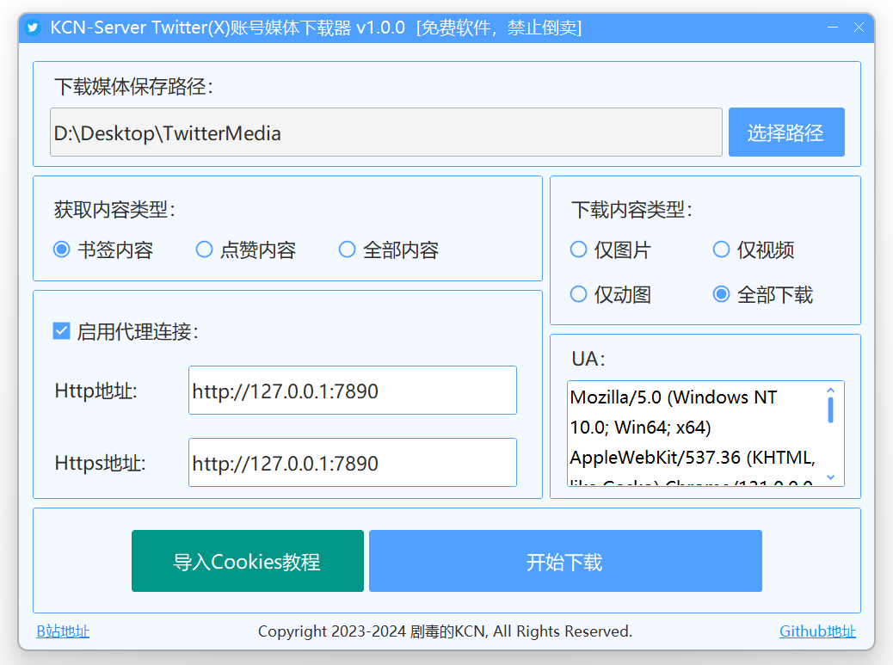
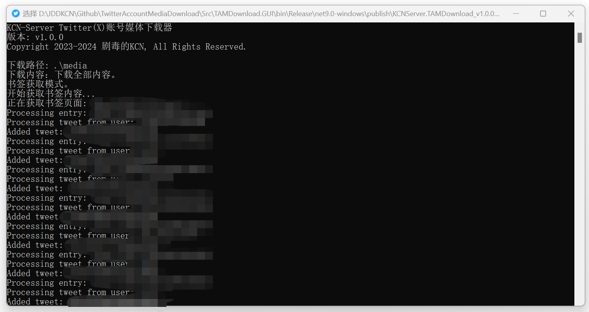

<strong>

# TwitterAccountMediaDownload

</strong>

## 📘 项目介绍

本项目是为 `Twitter (X)` 编写的账号点赞、书签等媒体的爬虫下载器。程序内核与GUI均使用 `.NET9` 构建。 本项目使用 `A-GPLv3` 开源协议。

 ### ✨ 实现功能
 - 自定义爬取账号点赞、书签或全部内容的媒体文件。
 - 自定义下载类型，图片、视频、动图或全部下载。
 - 支持断点续传&增量更新，每次运行会基于上次进度继续爬取。
 - 自定义的代理设置。
 - 开箱即用的GUI界面，小白用户更容易上手。

 ### 🐱 作者的话
 > 因为大家的debug&issues，软件才能越来越完善，欢迎Pr！将来可能还会写一些方便的新功能，敬请期待喵！
  >
  > 欢迎加入QQ交流群 **1140538395** 反馈Bug。

 ### 🖼️ 软件截图

|  |
|:--:|
| **软件界面 (TAMDownload.GUI)** |

|  |
|:--:|
| **软件界面 (TAMDownload.Core)** |

## 💾 软件下载

### 下载二进制分发文件 (开箱即用)
请到最新 [**Releases**](https://github.com/JDDKCN/TwitterAccountMediaDownload/releases/) 处下载。

### 通过源代码自行构建
请下载 [**项目源码**](https://github.com/JDDKCN/TwitterAccountMediaDownload/archive/refs/heads/main.zip) 自行编译，需要 `Visual Studio` 与 `.NET 9` 开发环境。

## 🚀 快速入门 · 账号Cookies获取

|  |
|:--:|
| **Cookies获取示意图** |

1. 首先在浏览器中登录账号。
2. 进入<个人资料>页面，点击 `喜欢的内容` 。
3. 停留在此页面，按 `F12` 或 `Fn+F12` 唤出开发者工具。
4. 在开发者工具顶栏中找到并进入 `网络 (Internet)` 项。
5. 点击筛选栏右侧的 `Fetch/XHR` 筛选按钮，在筛选栏左侧的过滤器输入框中输入 `like` 。
6. 点击过滤出的项，查看右侧 `标头` 项的 `请求标头` - `Cookie` 。
7. 复制完整Cookie文字到控制台中即可。

## 🖥️ 系统支持

| 系统 | 可用性 | 支持版本 |
|------|--------|---------|
| Windows | 完整支持 (Windows 10 及以上版本) | x86、x64、Arm、Arm64 |
| Linux | 仅支持内核运行 | x64、Arm、Arm64 |
| Mac OS | 仅支持内核运行 | x64、Arm64 |

## ⚠️ 免责声明
本项目仅供研究交流用，禁止用于商业及非法用途。使用本项目造成的事故与损失，与作者无关。本项目完全免费，如果您是花钱买的，说明您被骗了。请尽快退款，以减少您的损失。

## 🌐 其他平台
前往我的 [**B站主页**](https://space.bilibili.com/475547854/) : 剧毒的KCN

关注我的 [**Twitter账号**](https://twitter.com/2233KCN03) : @2233kcn03

加入我的 [**QQ交流群**](http://qm.qq.com/cgi-bin/qm/qr?_wv=1027&k=_-W8U_Mrz_nOu3eD_u3VGiPICKe9t7zY&authKey=rB2PW5mIrIY3ARjMqqWtw%2F2Qpejm5EArmuy95Wq1GfC7gLzUzTRATTnULKUKtb76&noverify=0&group_code=1140538395) : 1140538395